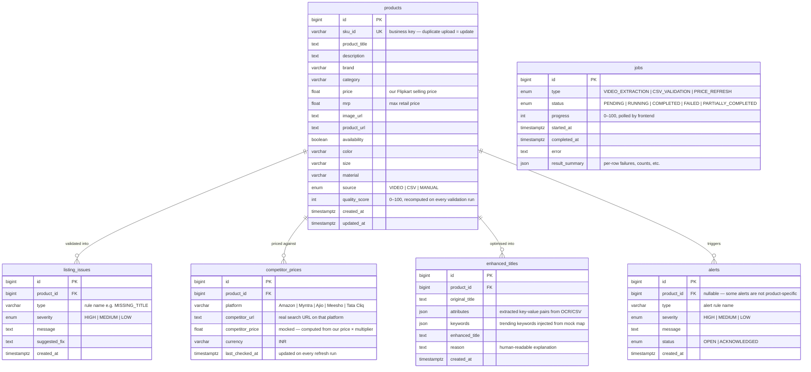

# Database Design

## ER Diagram



---

## Table-by-Table Explanation

### `products` — core entity
Every listing lives here. `sku_id` is the **business key** (unique constraint). Uploading the same SKU twice updates the existing row rather than inserting a duplicate. `quality_score` is recomputed every time validation runs:

```
score = 100
       − 20 per HIGH issue
       − 10 per MEDIUM issue
       −  3 per LOW issue
       (floor = 0)
```

`source` records how the product entered the system: `VIDEO` (OCR extraction), `CSV` (bulk upload), or `MANUAL` (PATCH edit via UI).

---

### `jobs` — async task tracker
There is no external queue. Every background operation creates a `jobs` row. The frontend polls `GET /jobs/{id}` to read `status` and `progress` (0–100). `result_summary` is a JSON blob that carries per-row failure details for CSV jobs, or extraction metadata for video jobs.

Jobs are **decoupled from products** intentionally — one job processes many products, so a direct FK doesn't make sense.

---

### `listing_issues` — validation output
One row per broken rule per product. Re-running validation deletes all old issues for that product and inserts fresh ones (cascade delete on the FK). `suggested_fix` is shown inline in the UI next to each issue.

---

### `competitor_prices` — price intelligence
One row per **product × platform**. Every "Refresh Prices" run upserts these rows. `last_checked_at` is updated on every refresh, giving you a built-in time-series for the price history chart. The comparison block (lowest, highest, avg, gap, recommended action) is computed on-the-fly — not stored.

> **Note:** Prices are mocked (computed locally, no web scraping). URLs are real platform search pages so "View →" links resolve.

---

### `alerts` — notification log
Raised automatically by business rules after validation or a price refresh. `product_id` is **nullable** so a system-level alert can exist without being tied to a product. Users can acknowledge an alert (OPEN → ACKNOWLEDGED) from the UI.

---

### `enhanced_titles` — title suggestion history
Stores the full audit trail of a title enhancement run: extracted attributes, injected trending keywords, final title, and the reason string. Multiple enhancements per product are kept (not overwritten) so history is visible.

---

## Relationships at a Glance

```
products  (1) ──── (many)  listing_issues      cascade delete
products  (1) ──── (many)  competitor_prices   cascade delete
products  (1) ──── (many)  enhanced_titles     cascade delete
products  (1) ──── (many)  alerts              product_id nullable
jobs      ── standalone, no FK to products ──
```

---

## Key Design Decisions

| Decision | Reason |
|---|---|
| `sku_id` unique constraint | Business deduplication — reupload same SKU → update, not duplicate row |
| Issues cascade-deleted on re-validation | Stale results must never outlive a fresh validation run |
| `competitor_prices` upserted per platform | One row per platform keeps the table small; `last_checked_at` serves as history timestamp |
| `alerts.product_id` nullable | Supports system-level alerts not tied to any specific product |
| `jobs.result_summary` as JSON | Flexible schema for per-job metadata without additional tables |
| All timestamps with timezone | Render (UTC) and local dev remain consistent |
| `jobs` decoupled from `products` | One job processes many products; a direct FK would be misleading |
